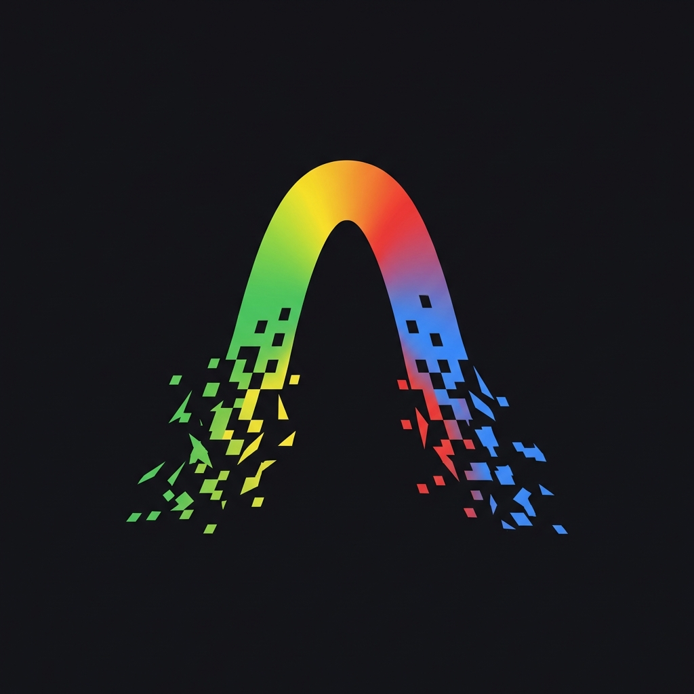

# 🚀 Anti-Chaotic Agent Kit

<p align="center">
  
</p>

> **The Unified Agent Kit for AI-Driven Development** - A comprehensive toolkit for software development powered by AI Agents.

[](https://opensource.org/licenses/MIT)
[](http://makeapullrequest.com)

---

## 🎯 Introduction

**Anti-Chaotic** is a comprehensive **Agent Kit** for Antigravity, designed to standardize and optimize your software development workflow.

### 🎯 Core Philosophy

> **Process over Speed**: This kit is designed for **development teams** and **collaborative environments**. It prioritizes robust processes, structure, and long-term maintainability over "fast shipping" or quick hacks. It aims to bring standard engineering practices to AI-assisted coding.

### 🧩 Concepts

- **Skills = Knowledge**: What the agent knows (Best practices, languages, patterns).
- **Rules & Workflows = Process**: How the agent executes (Steps, restrictions, output formats).

_We encourage teams to customize these skills and define their own rules & workflows to align with their specific enterprise standards._

### 📦 Components

- 🧠 **12+ Multi-domain AI Skills** - From Product Manager, Business Analyst to Lead Architect.
- 🔄 **11 Automated Workflows** - Pre-defined, reusable work processes.
- 📜 **Rules Engine** - A rule system that ensures AI Agents follow project standards.
- 📚 **References Library** - Documentation references for various technologies.

---

## ✨ Key Features

### 🎭 AI Skills (12 Virtual Experts)

| Skill                   | Description                                           |
| ----------------------- | ----------------------------------------------------- |
| **product-manager**     | Product management, roadmap, RICE/Kano prioritization |
| **business-analysis**   | Business analysis, user stories, use cases            |
| **lead-architect**      | System architecture, ADR, RFC, technical specs        |
| **designer**            | UI/UX design, design systems, accessibility           |
| **frontend-developer**  | React, Vue, Angular, performance optimization         |
| **backend-developer**   | Node, Python, Go, Java - API design, security         |
| **devops-engineer**     | CI/CD, multi-cloud, observability                     |
| **qa-tester**           | Test planning, unit/E2E/security testing              |
| **ai-engineer**         | RAG pipelines, prompt engineering, AI integration     |
| **blockchain-engineer** | Smart contracts, Web3, decentralized protocols        |
| **rules-workflows**     | Create and manage rules, workflows                    |
| **skill-creator**       | Create new skills for the framework                   |

### 📜 Smart Rules Engine

- **Documentation Rules**: Standard document structure and formatting
- **Clean Code Rules**: Coding standards and best practices
- **Project Rules**: Project-specific conventions

> **ℹ️ Documentation & Tools**: The default generated documentation is optimized for **Obsidian**. If your team uses **Jira**, **GitHub**, or other tools, simply connect the relevant **MCP Server** and customize the `documents.md` rule to align the output format.

---

## 🚀 Quick Start

### 1. Recommended Setup (MCP Servers)

To achieve the best results, we highly recommend installing the following MCP (Model Context Protocol) servers:

- **[sequence-thinking](https://github.com/axiom-team/mcp-server-sequence-thinking)**: AI model for advanced problem breakdown and step-by-step reasoning.
- **[context7](https://github.com/axiom-team/mcp-server-context7)**: For managing and retrieving broad project context.

### 2. Initialize in your project

Run the following command in your project root to install the Agent Kit:

```bash
npx @kienha/anti-chaotic init
```

This will download the `.agent` folder containing all skills, rules, and workflows into your project.

### 3. Using the Agent Kit

Once initialized, start a new chat with your AI IDE (Cursor, Windsurf, etc.) and reference the installed rules/workflows.

#### Start a new project with AI:

```
/brainstorm Create a sales management application for a fashion store
```

#### Generate docs for an existing project:

```
/documentation
```

#### Design UI from requirements:

```
/ui-ux-design docs/020-Requirements/PRD-YourProject.md
```

### 4. Updating the Kit

To update your Agent Kit to the latest version:

```bash
npx @kienha/anti-chaotic update
```

---

## 📖 Workflow Guide

### How to Use Workflows

**Method 1: Slash Command**

```
/brainstorm [Your project description]
```

**Method 2: Direct Request**

```
Please run the brainstorm workflow to analyze requirements for an e-commerce project
```

**Method 3: File Reference**

```
Read and execute the workflow at .agent/workflows/brainstorm.md
```

---

## 💡 Tips for Best Results

- **Model Selection**:
  - **Workflows**: Use **Fast Mode** with a reasoning model (**Gemini 3 Pro High** / **Claude Thinking Model**) when running flows.
  - **Manual Edits**: Use **Planning Mode** when making edits without a workflow.
  - **Gemini 3 Flash**: Use only for **small tasks**. Do not use for large, complex operations.
- **Workflow Usage**:
  - **Tagging**: Only tag a workflow in the **first request** of each session. **Do not** tag 2 or more workflows in the same session.
- **Skills**:
  - **Explicit Activation**: Proactively call a skill or use keywords associated with it for better efficiency.

---

## 🎓 Workflow Details

## 🔄 Automated Workflows

| Workflow                 | Description                                                                                                | Use Case                                                           |
| :----------------------- | :--------------------------------------------------------------------------------------------------------- | :----------------------------------------------------------------- |
| **`/bootstrap`**         | Sets up project structure, installs dependencies, and configures environment based on architectural specs. | Start of Implementation Phase.                                     |
| **`/brainstorm`**        | Analyze ideas with the user and create preliminary high-level documents (Roadmap, PRD).                    | Start of a new project or feature when you only have a rough idea. |
| **`/break-tasks`**       | Orchestrates breaking down requirements into actionable tasks for implementation.                          | When you have a PRD and need a task list.                          |
| **`/custom-behavior`**   | Safely customize Agent rules and workflows with impact analysis and user confirmation.                     | Adjust Agent behavior or fix recurring mistakes.                   |
| **`/debug`**             | Scientific debugging workflow: Hypothesize, Instrument, Reproduce, Analyze, Fix.                           | When facing complex bugs that need systematic analysis.            |
| **`/development`**       | General coding workflow for implementing changes, bug fixes, or minor features.                            | Day-to-day coding tasks.                                           |
| **`/documentation`**     | Generate comprehensive documentation (Architecture, API, Specs) from either Codebase or Requirements.      | Onboarding or creating detailed specs.                             |
| **`/gen-tests`**         | Generate unit, E2E, security, and performance tests using the qa-tester skill.                             | Improving test coverage for new or existing code.                  |
| **`/implement-feature`** | Orchestrates feature implementation from specification to deployment.                                      | End-to-end feature development.                                    |
| **`/qa`**                | Create comprehensive test case documents and test plans based on project requirements.                     | Planning testing strategy for a feature.                           |
| **`/ui-ux-design`**      | Transform requirements into comprehensive UI/UX design deliverables.                                       | After requirements are finalized, before coding.                   |

---

## 🤝 Contributing

We welcome all contributions! See [CONTRIBUTING.md](CONTRIBUTING.md) for detailed guidelines.

### How to Contribute

1. Fork the repository
2. Create a new branch (`git checkout -b feature/amazing-feature`)
3. Commit changes (`git commit -m 'Add amazing feature'`)
4. Push to branch (`git push origin feature/amazing-feature`)
5. Open a Pull Request

---

## 📄 License

This project is released under the [MIT License](LICENSE).

---

<p align="center">
  <b>Made with ❤️ for the AI-Driven Development Community</b>
</p>
